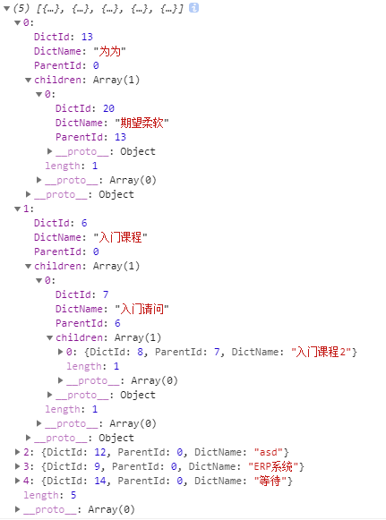

# tree结构实现

1. 常规

   ```javascript
   const sourceArr = [
       { DictId: 13, ParentId: 0, DictName: '为为' },
       { DictId: 8, ParentId: 7, DictName: '入门课程2' },
       { DictId: 7, ParentId: 6, DictName: '入门请问' },
       { DictId: 20, ParentId: 13, DictName: '期望柔软' },
       { DictId: 6, ParentId: 0, DictName: '入门课程' },
       { DictId: 12, ParentId: 0, DictName: 'asd' },
       { DictId: 9, ParentId: 0, DictName: 'ERP系统' },
       { DictId: 14, ParentId: 0, DictName: '等待' }
   ];
   ```

   ```javascript
   function getTree(
   source,
    {
       id = 'id', //源数据id对应名字
       parentId = 'parentId', //源数据parentId对应名字
       levelOnelVal = 0, //源数据一级时parentId的值
       children = 'children' //子级名字
   }
   ) {
       const cloneSource = JSON.parse(JSON.stringify(source)); //为了不破坏源数据结构，进行数据clone
       const tree = cloneSource.filter(item => {
           //为筛选项添加子级
           const childArr = cloneSource.filter(childItem => {
               return childItem[parentId] == item[id];
           });
           if (childArr.length > 0) {
               item[children] = childArr;
           }
           //返回一级数据，数据在上有子级的话，上面已经筛选添加
           return item[parentId] == levelOnelVal;
       });
       return tree;
   }
   ```

   ```javascript
   const treeArr = getTree(sourceArr, {
       id: 'DictId',
       parentId: 'ParentId'
   });
   treeArr //返回值为下图
   ```

   

2.  一个特殊情况--数据还得根据另一个字段排列

   ```javascript
   const sourceArrSp = [
       {
           DictId: 13,
           ParentId: 0,
           DictType: 3,
           DictName: '为为'
       },
       {
           DictId: 8,
           ParentId: 7,
           DictType: 3,
           DictName: '入门课程2'
       },
       {
           DictId: 7,
           ParentId: 6,
           DictType: 3,
           DictName: '入门请问'
       },
       {
           DictId: 20,
           ParentId: 13,
           DictType: 3,
           DictName: '期望柔软'
       },
       {
           DictId: 6,
           ParentId: 0,
           DictType: 3,
           DictName: '入门课程'
       },
       {
           DictId: 27,
           ParentId: 0,
           DictType: 1,
           DictName: '饿哦'
       },
       {
           DictId: 12,
           ParentId: 0,
           DictType: 3,
           DictName: 'asd'
       },
       {
           DictId: 26,
           ParentId: 0,
           DictType: 1,
           DictName: '呃呃'
       },
       {
           DictId: 9,
           ParentId: 0,
           DictType: 3,
           DictName: 'ERP系统'
       },
       {
           DictId: 14,
           ParentId: 0,
           DictType: 3,
           DictName: '等待'
       },
       {
           DictId: 10,
           ParentId: 0,
           DictType: 1,
           DictName: '我的'
       },
       //下面的数据是自定义的，作为一级
       {
           DictId: -1,
           ParentId: '0',
           DictName: '系统'
       },
       {
           DictId: -3,
           ParentId: '0',
           DictName: '学院'
       },
       {
           DictId: 0,
           ParentId: '0',
           DictName: '全部'
       }
   ];
   ```

   ```javascript
   function getTreeSp(
   source,
    {
       id = 'id', //源数据id对应名字
       parentId = 'parentId', //源数据parentId对应名字
       levelOnelVal = 0, //源数据一级时parentId的值
       children = 'children', //子级名字
       other //另一个排序字段
   }
   ) {
       const cloneSource = JSON.parse(JSON.stringify(source)); //为了不破坏源数据结构，进行数据clone
       const tree = cloneSource.filter(item => {
           //为筛选项添加子级
           const childArr = cloneSource.filter(childItem => {
               return (
                   (childItem[parentId] == item[id] && item[id]) ||
                   childItem[other] == -item[id]
               );
           });
           if (childArr.length > 0) {
               item[children] = childArr;
           }
           //返回一级数据，数据在上有子级的话，上面已经筛选添加
           return item[parentId] === levelOnelVal;
       });
       return tree;
   }
   ```

   ```javascript
   const treeArrSp = getTreeSp(sourceArrSp, {
       id: 'DictId',
       parentId: 'ParentId',
       levelOnelVal: '0',
       other: 'DictType'
   });
   treeArrSp //返回值为下图
   ```

   

   